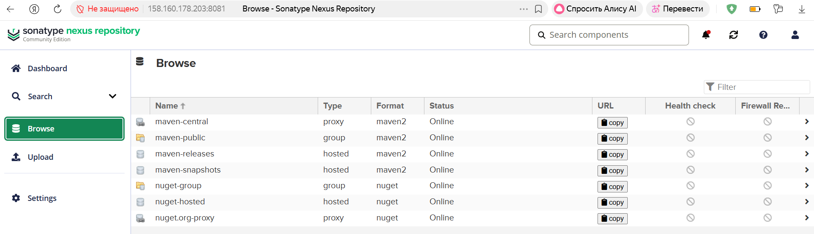
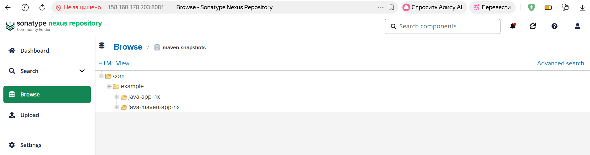
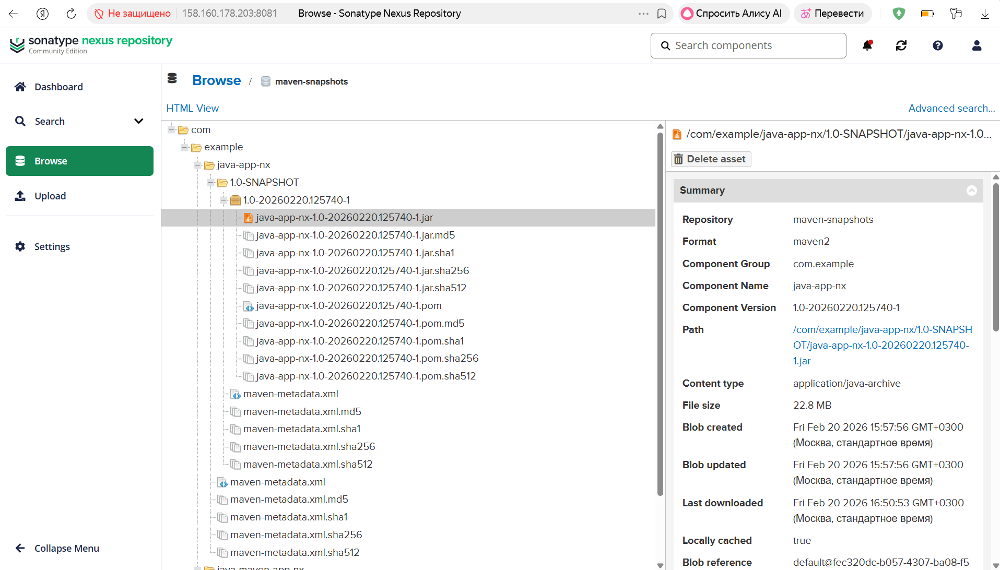
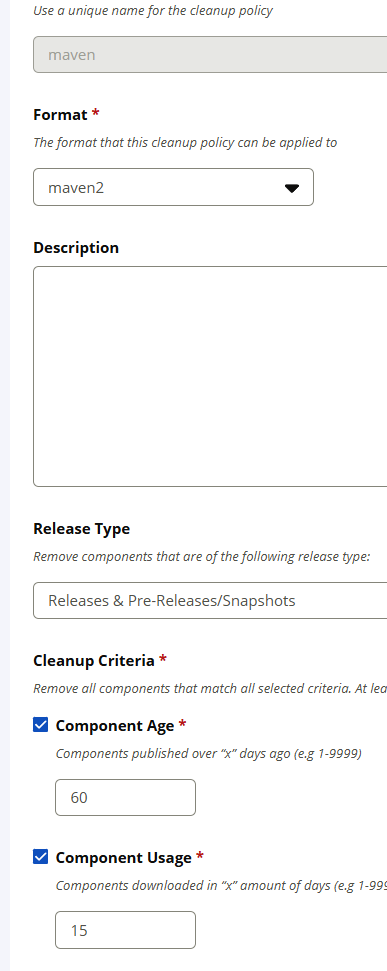
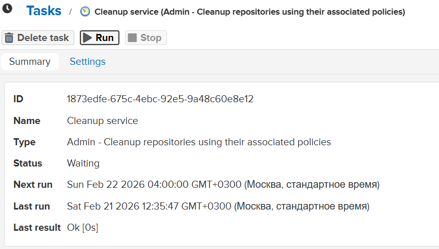
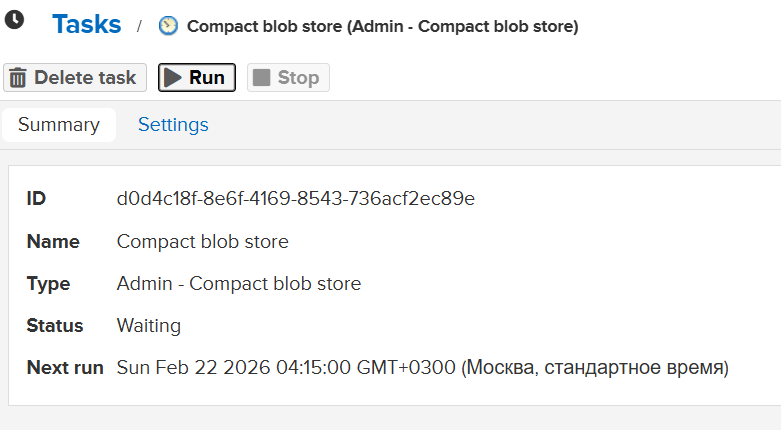

# Demo Project

## 📌 Overview
Run Nexus on a YandexCloud and publish artifacts to Nexus.

---

## 🛠 Technologies Used
- Nexus
- YandexCloud
- Linux
- Java
- Gradle
- Maven

---

## 📖 Project Description

- Install and configure Nexus from scratch on a cloud server
- Create a new Linux user with appropriate permissions
- Java Gradle Project: Build JAR and upload to Nexus
- Java Maven Project: Build JAR and upload to Nexus
- Configure Nexus cleanup policies

---

## 🌐 Live Demo

Credentials must be configured in the `gradle.properties` file for the Gradle project and in the `~/.m2/settings.xml` file for the Maven project.

The nexus browser ui can be accessed at:

http://158.160.178.203:8081

> ⚠️ Note: The address may be temporarily unavailable if the cloud server is inactive (for example, if the hosting service has not been paid).

---

## 📸 Screenshots

#### Cleanup policies and tasks

